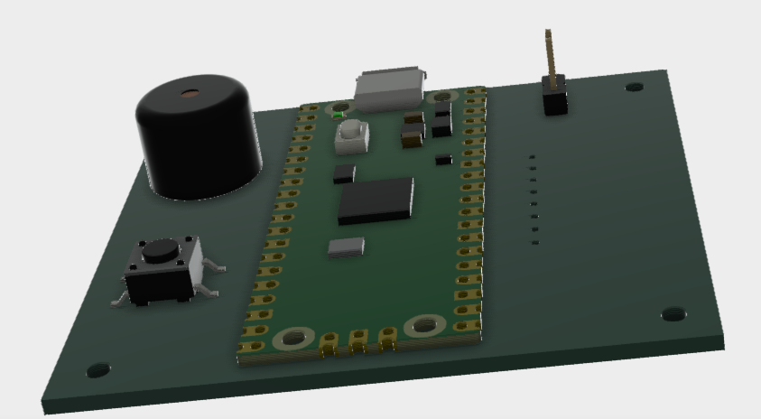
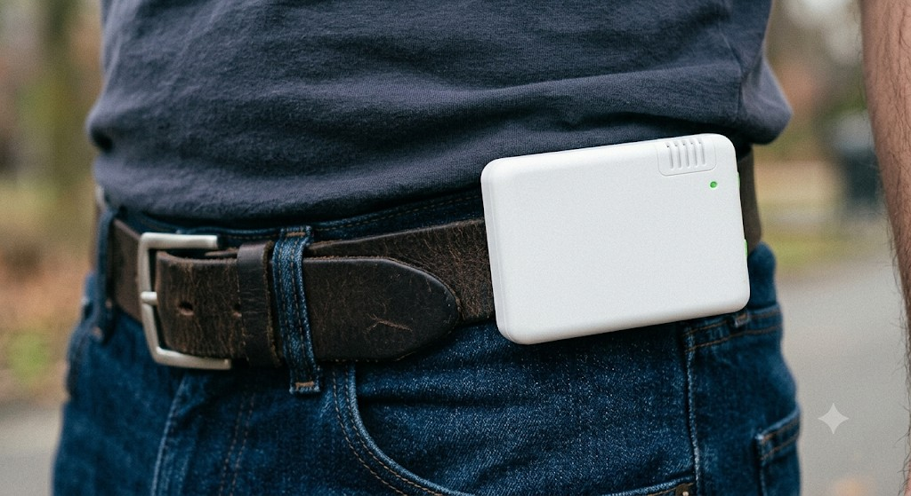

# Fall Monitor — Edge AI / TinyML Fall-Detection Wearable

> **Status: 🚧 Work in Progress.** The firmware, data pipeline, and trained model are functional on a Raspberry Pi Pico dev board. A **custom PCB is currently in transit** and will replace the breadboard prototype — hardware bring-up, enclosure design, and battery/power work are the next milestones.

A wearable device that detects human falls in real time using an on-device neural network. Accelerometer data is captured on a **Raspberry Pi Pico (RP2040)**, classified locally with a **TensorFlow Lite for Microcontrollers** model trained in **Edge Impulse**, and used to raise a fall alert — all without a network connection or the cloud.

---


## Table of Contents

- [Overview](#overview)
- [How It Works](#how-it-works)
- [Hardware](#hardware)
- [Design & Renders](#design--renders)
- [Repository Structure](#repository-structure)
- [Firmware Builds](#firmware-builds)
- [Building & Flashing](#building--flashing)
- [Data Pipeline](#data-pipeline)
- [Model](#model)
- [Roadmap](#roadmap)
- [Tech Stack](#tech-stack)
- [License](#license)

---


## Overview

Falls are a leading cause of injury, especially amongthe elderly and those prone to fainting or passing out. This project implements a compact, self-contained fall detector that runs entirely at the edge:

- **Real-time inference** on a microcontroller: no external devices or internet required.
- **Custom-trained model** built from data collected on the device itself, so the model learns from the exact sensor and mounting position it will run on.
- **End-to-end workflow**: project contains programs for entire build process from raw data collection, through labeling and windowing, to training and on-device deployment.


## How It Works

```
        MPU-6050 (I2C, 50 Hz)
                │  accel x / y / z
                ▼
        ┌───────────────────┐
        │  Circular buffer   │   2 s window = 100 samples × 3 axes = 300 features
        │   (RP2040 / Pico)  │
        └───────────────────┘
                │  window full
                ▼
        ┌───────────────────┐
        │  Edge Impulse DSP  │   spectral feature extraction
        │  + TFLite Micro NN │   → [ ADL , Fall ]
        └───────────────────┘
                │  P(Fall) > 0.80
                ▼
          Fall alert (GPIO output)
```

1. The MPU-6050 accelerometer is sampled over I2C at **50 Hz**.
2. Raw readings are converted to m/s² and pushed into a **rolling circular buffer** holding the most recent **2 seconds** of motion (100 samples).
3. Once the buffer is full, the 300-value window is flattened and passed to the Edge Impulse classifier via `run_classifier()`.
4. If the model reports a **Fall** probability above **0.80**, a GPIO pin is driven high to signal an alert.


## Hardware


| Component     | Details                                                                                                          |
| ------------- | ---------------------------------------------------------------------------------------------------------------- |
| **MCU**       | Raspberry Pi Pico / RP2040 (dual-core Cortex-M0+)                                                                |
| **Sensor**    | MPU-6050 6-axis IMU (accelerometer used), I2C address `0x68`                                                     |
| **Bus**       | I2C0 @ 100 kHz — `SDA = GPIO0`, `SCL = GPIO1`                                                                    |
| **Fall I/O**  | `GPIO2` — button input for labeling during data collection / alert output during inference                       |
| **Interface** | USB CDC serial (UART disabled) for logging and data capture                                                      |
| **PCB**       | Custom board **in transit** — will consolidate the Pico + MPU-6050 + fall I/O into a single wearable form factor |


## Design & Renders

The custom PCB was designed in **[KiCad](https://www.kicad.org/)**. The board is currently in transit; the renders and mockups below capture the intended hardware.

<table>
  <tr>
    <td align="center" width="50%">
      
      <br><sub><b>PCB Render</b> — Pico, MPU-6050, buzzer, and fall button on a single board</sub>
    </td>
    <td align="center" width="50%">
      
      <br><sub><b>Final Vision Mockup</b> — compact, belt-worn enclosure</sub>
    </td>
  </tr>
</table>


## Repository Structure

```
fallMonitor/
├── dataCollection.cpp      # Firmware: stream accelerometer data over USB serial (+ label button)
├── inference.cpp           # Firmware: run the on-device classifier and raise fall alerts
├── CMakeLists.txt          # Pico SDK build; produces dataCollection.uf2 and inference.uf2
├── dataPipeline/           # Python tools for capturing, labeling, and windowing data
│   ├── dataLog.py          #   Record serial output from the Pico into a CSV
│   ├── addTimestamp.py     #   Add a 20 ms-step timestamp column
│   ├── extractFallEvents.py#   Generate staggered 2 s windows around each fall trigger
│   ├── extractADL.py       #   Slide continuous 2 s windows over normal-activity (ADL) data
│   ├── splitData.py        #   Split a labeled dataset into fixed-size chunks
│   └── data/               #   Raw, labeled, and chunked datasets
├── model-parameters/       # Edge Impulse model metadata (generated)
├── tflite-model/           # Exported trained TFLite model (generated)
└── edge-impulse-sdk/       # Vendored Edge Impulse / TFLite-Micro inference SDK (generated)
```


## Firmware Builds

The CMake project produces **two independent firmware images** from a shared Edge Impulse static library:


| Target           | Output               | Purpose                                                                                                                          |
| ---------------- | -------------------- | -------------------------------------------------------------------------------------------------------------------------------- |
| `dataCollection` | `dataCollection.uf2` | Streams `x, y, z, index, fall_flag` over USB serial for dataset capture. Press the fall button to mark ground-truth fall events. |
| `inference`      | `inference.uf2`      | Runs the trained classifier on the live buffer and drives the fall-alert GPIO.                                                   |


## Building & Flashing

**Prerequisites:** the [Raspberry Pi Pico SDK](https://github.com/raspberrypi/pico-sdk) and toolchain (the [Raspberry Pi Pico VS Code extension](https://marketplace.visualstudio.com/items?itemName=raspberry-pi.raspberry-pi-pico) sets this up automatically), plus CMake ≥ 3.13.

```bash
mkdir build && cd build
cmake ..
cmake --build .
```

Flash by holding **BOOTSEL** while connecting the Pico, then copy the desired image to the mounted drive:

```bash
# Data collection build
cp dataCollection.uf2 /path/to/RPI-RP2

# Inference build
cp inference.uf2 /path/to/RPI-RP2
```


## Data Pipeline

The Python tools in `dataPipeline/` turn raw device output into an Edge Impulse-ready dataset:

1. **Capture** — flash `dataCollection.uf2`, then record the serial stream:
  ```bash
   python dataPipeline/dataLog.py        # writes a CSV of x, y, z, fall_indicator
  ```
   Press the fall button during recording to label real fall moments.
2. **Timestamp** — add a monotonic time column (20 ms per sample @ 50 Hz):
  ```bash
   python dataPipeline/addTimestamp.py raw_capture.csv
  ```
3. **Window the falls** — create 10 overlapping 2-second windows around each `0→1` fall trigger:
  ```bash
   python dataPipeline/extractFallEvents.py raw_capture.csv
  ```
4. **Window the ADL data** — slide continuous 2-second windows (50 % overlap) over normal daily-activity recordings, labeled `0` (not a fall):
  ```bash
   python dataPipeline/extractADL.py raw_adl_data.csv <session_id>
  ```
5. **Chunk** — split a large labeled file into fixed-length samples for upload:
  ```bash
   python dataPipeline/splitData.py
  ```

The resulting labeled windows are uploaded to Edge Impulse for training.

## Model


| Property         | Value                                               |
| ---------------- | --------------------------------------------------- |
| Project          | `FallDetectionWearable` (Edge Impulse ID `1027531`) |
| Classes          | `ADL`, `Fall`                                       |
| Sample rate      | 50 Hz (20 ms interval)                              |
| Window           | 2 s → 100 samples × 3 axes = 300 raw values         |
| DSP              | Spectral feature extraction                         |
| Inference engine | TensorFlow Lite for Microcontrollers                |
| Alert threshold  | `P(Fall) > 0.80`                                    |


## Roadmap

- [x] Accelerometer sampling & rolling-window firmware on the Pico
- [x] Serial data-logging and Python labeling/windowing pipeline
- [x] Edge Impulse model trained and running on-device
- [x] Design custom carrier board PCB (currently shipping)
- [ ] Develop Physical housing for electronics
- [ ] Fine-tune model with final hardware and more diverse data


## Tech Stack

**Embedded C/C++** · **Raspberry Pi Pico SDK** · **CMake** · **Edge Impulse** · **TensorFlow Lite for Microcontrollers** · **Python (pandas, NumPy, pySerial)** · **MPU-6050 / I2C** · **KiCad (PCB design)**

## License

Project firmware and pipeline code are authored by the project owner. The contents of `edge-impulse-sdk/`, `model-parameters/`, and `tflite-model/` are generated by Edge Impulse and are subject to the [Edge Impulse Terms of Service](https://edgeimpulse.com/legal/terms-of-service).